# Improve My City – Frontend

A modern, enterprise-grade web application for municipal issue reporting and management. Built with React, TypeScript, and Vite for optimal performance and developer experience.
This project was created as part of **HackArena 2025, hosted by Masaiverse × NoBroker**

## 🌐 Live Demo

[](https://imc.varunanalytics.com/)

[](https://imcb.varunanalytics.com/)

---

## 📸 Screenshots
### Public-Facing Features

🏙️ Dashboard — Overview of Active Issues
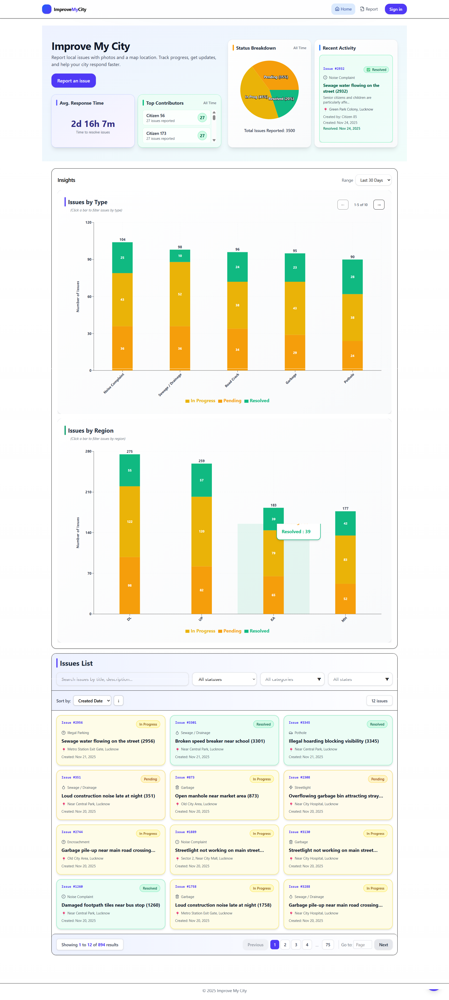

📍 Report an Issue — Map Picker & Category Selection
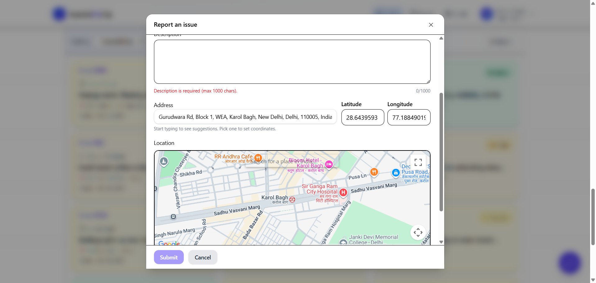

🔎 Issue Detail — Timeline, Activity & Related Issues
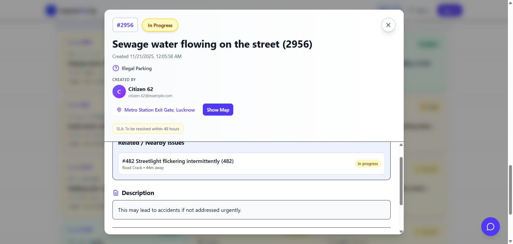

📊 Interactive Charts — Issue Trends & Category Breakdown
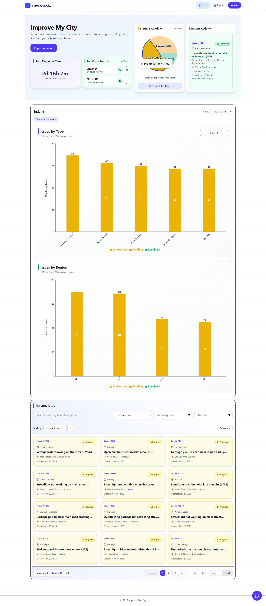

🤖 AI Chatbot — Citizen FAQs & Issue Assistance
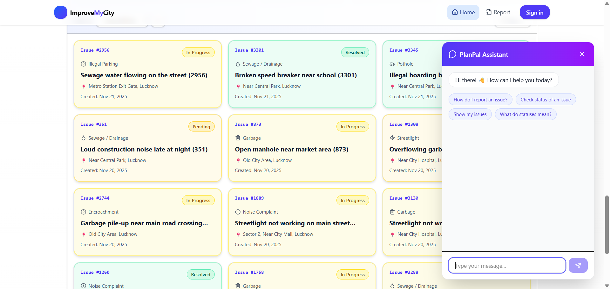

### Admin Features

📊 Admin Dashboard — Analytics, Regions & Heatmaps
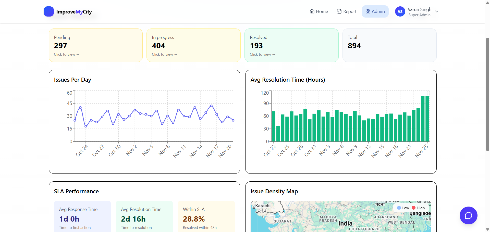

🗂️ Issue Management — Filters, Pagination & Bulk Actions
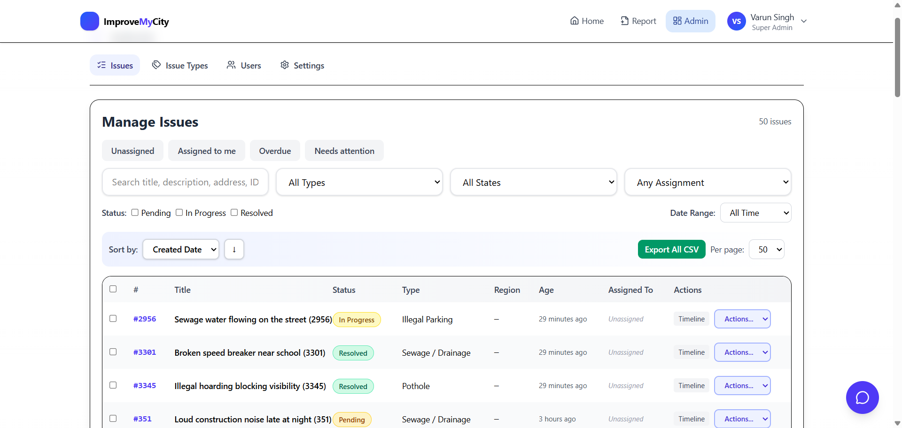

🎨 Issue Types — Colors, Order & Descriptions
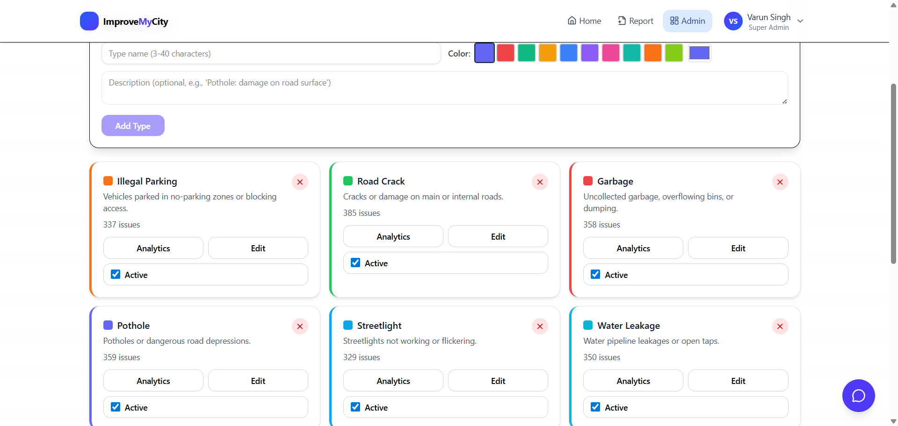

👥 User Management — Staff, Citizens & Roles
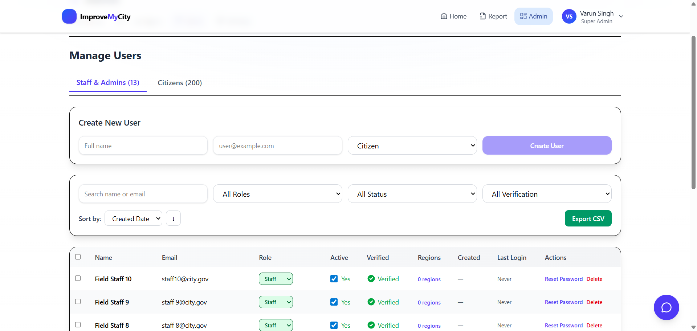

⚙️ Settings — SLA, Branding, Email & Notifications
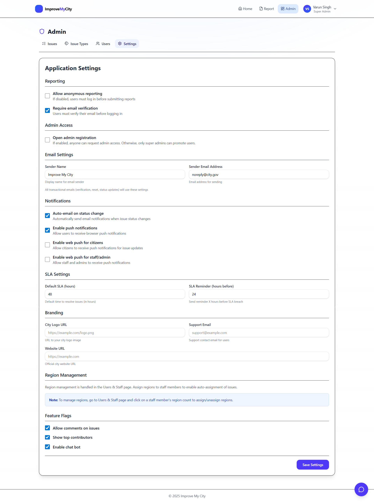

### Mobile Experience

📱 Home — Responsive Dashboard View
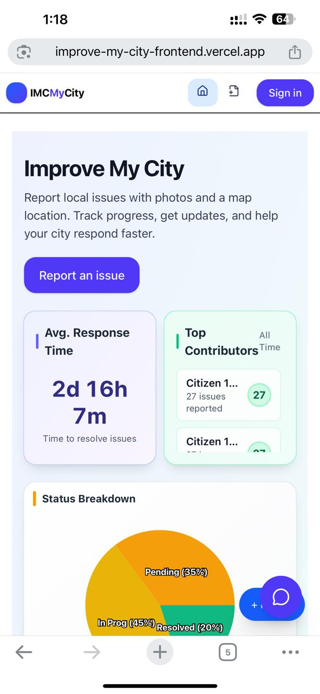

📝 Report Issue — Mobile Flow
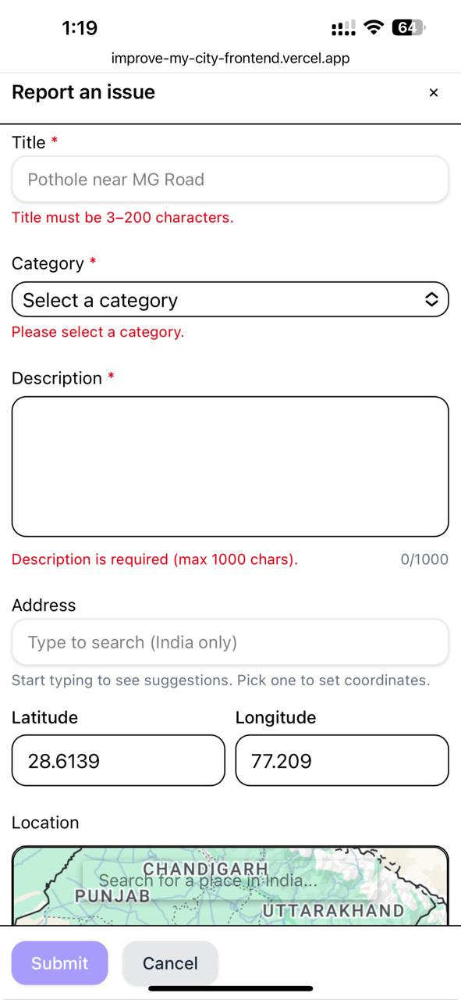
---

## ✨ Features

### 👥 Citizen-Facing Features

#### Issue Reporting
- **Rich Issue Reports**: Title, description, category selection, and multiple photo uploads
- **Interactive Map Integration**: Google Maps picker for precise location selection
- **Address Auto-detection**: Automatic address resolution from coordinates
- **Duplicate Detection**: Smart detection of similar issues (same category + location within 50m) with confirmation modal
- **Anonymous Reporting**: Optional anonymous issue submission (configurable)
- **Comprehensive Validations**: Title (3-200 chars), description (1-1000 chars), address, location (India only), file size/type limits

#### Issue Tracking & Engagement
- **Real-time Status Updates**: Track issue status (Pending → In Progress → Resolved)
- **Interactive Comments**: Comment on issues until resolution with staff avatars
- **Activity Timeline**: Complete history of issue updates and status changes
- **Related Issues**: View nearby or similar issues automatically
- **Push Notifications**: Browser push notifications for status changes
- **Email Notifications**: Automatic email updates on issue status changes

#### User Experience
- **Modern Responsive UI**: Mobile-first design with TailwindCSS
- **Smart Chatbot**: AI-powered chatbot for common queries, issue tracking, and status checking by issue number
- **Advanced Filtering**: Filter by status, category, region, date range, and search
- **Interactive Charts**: Visual analytics with pie charts and bar charts (with percentage tooltips)
- **Recent Activity Feed**: Rotating display of recent issue updates
- **Toast Notifications**: Prominent, non-intrusive notifications for user actions

### 🛡️ Admin & Staff Features

#### Dashboard & Analytics
- **Comprehensive Dashboard**: Overview cards with pending, in-progress, resolved, and total counts
- **Interactive Charts**: 
  - Status breakdown pie chart (all-time data with toggle selection)
  - Issues by type bar chart (filtered data)
  - Issues by region bar chart (filtered data)
- **Map Heatmap**: Visual density map of issue locations
- **Trend Analysis**: Daily trends and resolution time metrics
- **SLA Performance**: Average resolution times and SLA compliance tracking
- **Time Range Filters**: Today, 7 days, 30 days, 90 days, all-time

#### Issue Management
- **Advanced Issue Table**: 
  - Quick filters: Unassigned, Assigned to me, Overdue, Needs attention
  - Age indicators: "2 hours ago", "5 days old", "Stalled • 3 days no update"
  - Resolution time display for resolved issues
  - Bulk actions: Assign, change status, delete, export
  - CSV/Excel export functionality
  - Activity timeline in modal view
- **Enhanced Issue Detail View**:
  - Larger title with colored status badges
  - Created by and updated timestamps
  - Embedded Google Maps with zoomable marker
  - Assignment section with staff dropdown
  - Resolution section with SLA time display
  - Complete activity timeline
  - Related issues (within 50m radius)
  - Full-screen image gallery
  - Enhanced comments with staff avatars

#### Issue Types Management
- **Rich Issue Type Cards**:
  - Description field for each type
  - Color coding with presets and custom colors
  - Drag & drop reordering
  - Analytics modal: Last 7 days count, average resolution time, trends
  - Issue count display
  - Active/inactive toggle
  - Delete prevention for types with existing issues

#### User & Staff Management
- **Comprehensive User Profiles**:
  - Full user details modal
  - Activity stats: Issues handled, created, resolved
  - Recent activity timeline
  - Region assignments
- **Advanced Filtering**:
  - Verified vs unverified
  - Active vs inactive
  - Role-based filtering
  - Region-wise filtering
  - Last login date sorting
- **Bulk Operations**:
  - Activate/deactivate multiple users
  - Assign regions in bulk
  - Delete citizens in bulk
  - CSV export
- **User Actions**:
  - Password reset (admin-triggered)
  - Email verification status icons
  - Role management
  - Region assignment

#### Settings & Configuration
- **Notification Settings**:
  - Email sender configuration
  - Auto-email on status change toggle
  - Push notifications enable/disable
  - Web push for citizens and staff
- **SLA Management**:
  - Default SLA hours configuration
  - SLA reminder hours before breach
- **Branding**:
  - City logo URL
  - Support email
  - Website URL
- **Region Management**: Link to user management for region assignments
- **Feature Flags**: Toggle comments, top contributors, chatbot

### 🔒 Security & Safety Features

- **Duplicate Detection**: Prevents duplicate issue creation (same address + type within 2 hours)
- **Rate Limiting**: 10 issues per minute per user
- **Confirmation Dialogs**: For all destructive actions (delete, deactivate, etc.)
- **JWT Authentication**: Secure token-based authentication
- **Role-Based Access Control**: Admin, staff, and citizen roles with granular permissions
- **Protected Routes**: Admin routes require authentication and proper role
- **CSRF Protection**: Safe API communication

### 🤖 Automation Features

- **Auto-Assignment**: Automatic issue assignment based on:
  - Region/state code
  - Staff workload (least open issues)
  - Issue type expertise
- **Email Notifications**: Automatic emails for:
  - Issue creation confirmation
  - Status change updates
  - Assignment notifications
- **Push Notifications**: Real-time browser notifications for status changes

---

## 🛠️ Tech Stack

### Core
- **React 18** - Modern UI library
- **TypeScript** - Type-safe development
- **Vite** - Fast build tool and dev server
- **React Router** - Client-side routing

### Styling & UI
- **TailwindCSS** - Utility-first CSS framework
- **Lucide React** - Modern icon library
- **Recharts** - Composable charting library

### State Management & Data Fetching
- **Zustand** - Lightweight state management
- **TanStack Query (React Query)** - Powerful data synchronization
- **Axios** - HTTP client

### Maps & Location
- **Google Maps JavaScript API** - Interactive maps and location services

### Notifications
- **Web Push API** - Browser push notifications

### Development Tools
- **ESLint** - Code linting
- **TypeScript** - Static type checking

---

## 🚀 Getting Started

### Prerequisites

- **Node.js** 18+ and npm/pnpm
- **Google Maps API Key** (for location features)
- **VAPID Public Key** (for push notifications)
- **Backend API** running (see backend README)

### Installation

1. **Clone the repository**
   ```bash
   git clone https://github.com/vs-ai-ds/improve-my-city-frontend
   cd improve-my-city-frontend
   ```

2. **Install dependencies**
   ```bash
   pnpm install
   # or
   npm install
   ```

3. **Configure environment variables**
   
   Create `.env.local` file, refer to .env.local.example:
   ```env
   VITE_API_BASE_URL=http://localhost:8000
   VITE_GOOGLE_MAPS_API_KEY=your_google_maps_api_key
   VITE_VAPID_PUBLIC_KEY=your_vapid_public_key
   ```

4. **Start development server**
   ```bash
   pnpm dev
   # or
   npm run dev
   ```
  The app will be available at `http://localhost:5173`

### Building for Production

```bash
pnpm build
# or
npm run build
```
This generates optimized static files in the `dist/` folder.

---

## ☁️ Deployment

### Option 1: Vercel (Recommended for Quick Setup)

1. Connect your GitHub repository to Vercel
2. Add environment variables in Vercel dashboard
3. Deploy automatically on every push

**Benefits:**
- Automatic HTTPS
- Global CDN
- Zero-config deployment
- Preview deployments for PRs

### Option 2: Google Cloud Storage + CDN

1. **Build the application**
   ```bash
   pnpm build
   ```

2. **Upload to Cloud Storage**
   ```bash
   gsutil -m cp -r dist/* gs://your-bucket-name/
   ```

3. **Configure as static website**
   - Enable public access
   - Set index.html as main page
   - Enable Cloud CDN
   - Configure load balancer routing

**Benefits:**
- High performance with Cloud CDN
- Scalable infrastructure
- Custom domain support

### Option 3: Netlify

1. Connect GitHub repository
2. Set build command: `pnpm build`
3. Set publish directory: `dist`
4. Add environment variables
5. Deploy

---

## 📁 Project Structure

```
improve-my-city-frontend/
├── src/
│   ├── components/          # Reusable UI components
│   │   ├── auth/           # Authentication components
│   │   ├── dashboard/      # Dashboard charts and widgets
│   │   ├── report/         # Issue reporting components
│   │   ├── toast/          # Toast notifications
│   │   └── ui/             # Base UI components
│   ├── hooks/              # Custom React hooks
│   │   ├── useIssueFilters.ts    # Centralized filter management
│   │   └── useIssueTypes.ts     # Issue types hook
│   ├── pages/              # Page components
│   │   ├── admin/          # Admin pages
│   │   │   ├── AdminLandingPage.tsx    # Admin dashboard
│   │   │   ├── IssuesTablePage.tsx     # Issue management
│   │   │   ├── IssueTypesPage.tsx      # Issue types management
│   │   │   ├── AdminUsersPage.tsx      # User management
│   │   │   └── AdminLayout.tsx         # Admin layout wrapper
│   │   ├── HomePage.tsx    # Public homepage
│   │   ├── ReportPage.tsx  # Issue reporting
│   │   ├── ProfilePage.tsx # User profile
│   │   └── ...
│   ├── services/           # API service layer
│   │   ├── apiClient.ts    # Axios configuration
│   │   ├── issues.api.ts   # Issue API calls
│   │   ├── stats.api.ts    # Statistics API calls
│   │   └── admin.*.api.ts  # Admin API calls
│   ├── store/              # Zustand state stores
│   │   ├── useAuth.ts      # Authentication state
│   │   └── useReportModal.ts # Report modal state
│   ├── utils/              # Utility functions
│   │   ├── categoryIcons.ts
│   │   └── issueUtils.ts
│   ├── constants/          # App constants
│   └── App.tsx             # Main app component
├── public/                 # Static assets
├── docs/                   # Documentation and screenshots
│   └── screenshots/        # Screenshot images
├── .env.local.example      # Environment variables template
├── vite.config.ts          # Vite configuration
└── package.json            # Dependencies and scripts
```

---

## 🔑 Key Features Deep Dive

### Centralized Filter Management

The application uses a centralized `useIssueFilters` hook that ensures all components (charts, lists, dropdowns) display the same filtered dataset. This provides a consistent user experience where:

- Status pie chart acts as a controller (toggle selection)
- Bar charts and issue list always show the same filtered data
- Filter chips display active filters with clear options
- All filters are synchronized across components

### Advanced Issue Management

**Quick Filters:**
- Unassigned issues
- Assigned to me (for staff)
- Overdue issues (past SLA)
- Needs attention (stalled > X days)

**Bulk Actions:**
- Select multiple issues with checkboxes
- Bulk assign to staff
- Bulk status change
- Bulk delete
- Export to CSV

**Age Indicators:**
- Real-time age calculation ("2 hours ago")
- Stalled indicator for issues with no updates
- Resolution time display for resolved issues

### Enhanced Issue Detail View

**Key Improvements:**
- Larger, more prominent title
- Colored status badges
- Embedded Google Maps with zoomable marker
- Assignment dropdown with staff selection
- Complete activity timeline
- Related issues (within 50m, same category)
- Full-screen image gallery
- Enhanced comments with avatars

### Issue Types with Analytics

Each issue type card includes:
- Description field
- Color coding (presets + custom)
- Drag & drop reordering
- Analytics modal with:
  - Total issues count
  - Last 7 days count
  - Average resolution time
  - Trend indicators

### User Management

**Profile Modal:**
- Full user information
- Activity statistics
- Recent activity timeline
- Region assignments

**Bulk Operations:**
- Multi-select with checkboxes
- Bulk activate/deactivate
- Bulk region assignment
- Bulk delete (citizens only)
- CSV export

**Advanced Features:**
- Password reset (admin-triggered)
- Email verification status icons
- Sort by created date, last login, name, email
- Comprehensive filtering

---

## 🔐 Security

- **JWT Authentication**: Secure token-based authentication
- **Protected Routes**: Role-based route protection
- **CSRF Protection**: Safe API communication
- **Rate Limiting**: Backend-enforced rate limits
- **Input Validation**: Client and server-side validation
- **Secure File Uploads**: Image type and size validation

---

## 🧪 Development

### Available Scripts

```bash
# Start development server
pnpm dev

# Build for production
pnpm build

# Preview production build
pnpm preview

# Run linter
pnpm lint

# Type check
pnpm type-check
```

### Code Style

- Follow TypeScript best practices
- Use functional components with hooks
- Prefer composition over inheritance
- Keep components small and focused
- Use meaningful variable and function names
- Add comments only when necessary (code should be self-explanatory)

---

## 📊 Performance Optimizations

- **Code Splitting**: Automatic route-based code splitting
- **Lazy Loading**: Components loaded on demand
- **React Query Caching**: Intelligent data caching and refetching
- **Image Optimization**: Optimized image handling
- **Bundle Optimization**: Tree-shaking and minification
- **CDN Delivery**: Static assets served via CDN

---

## 🤝 Contributing

1. Fork the repository
2. Create a feature branch (`git checkout -b feature/amazing-feature`)
3. Commit your changes (`git commit -m 'Add amazing feature'`)
4. Push to the branch (`git push origin feature/amazing-feature`)
5. Open a Pull Request

---

## 📝 License

This project is licensed under the MIT License. See the `LICENSE` file for details.

---

## 🙏 Acknowledgments

- Built for HackArena (Masai x NoBroker)
- Uses Google Maps API for location services
- Powered by modern web technologies
- Pwered by Vercel, Render for hosting. 
- Uses Resend for email notification
- VAPID  for push notification

---

## 📞 Support

For issues, questions, or contributions, please open an issue on GitHub.

---

## 🔒 Security & Code Quality

### Recent Improvements (December 2025)
- ✅ Removed unused code and constants
- ✅ Fixed duplicate issue modal flow with proper z-index layering
- ✅ Enhanced report issue flow with comprehensive validations
- ✅ Improved duplicate detection UX with confirmation modal
- ✅ Fixed report icon positioning (left side for mobile)
- ✅ Enhanced error handling and user feedback
- ✅ Improved modal state management for nested modals
- ✅ Added percentage display to dashboard chart tooltips
- ✅ Enhanced chatbot with issue status checking and number input
- ✅ Fixed report modal to stay open when duplicate is detected
- ✅ Improved chat flow for "Show my issues" and "Report An Issue"


**Last Updated:** November 2025
